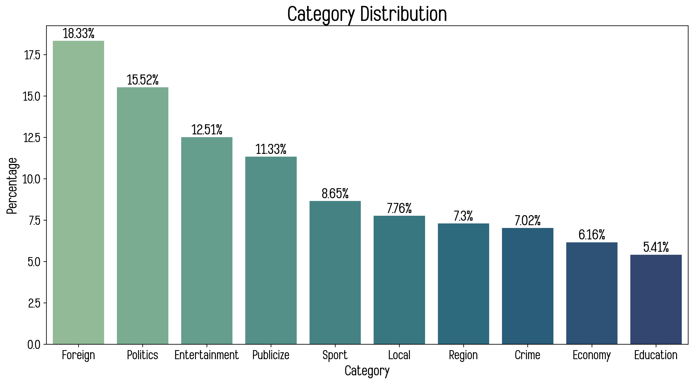
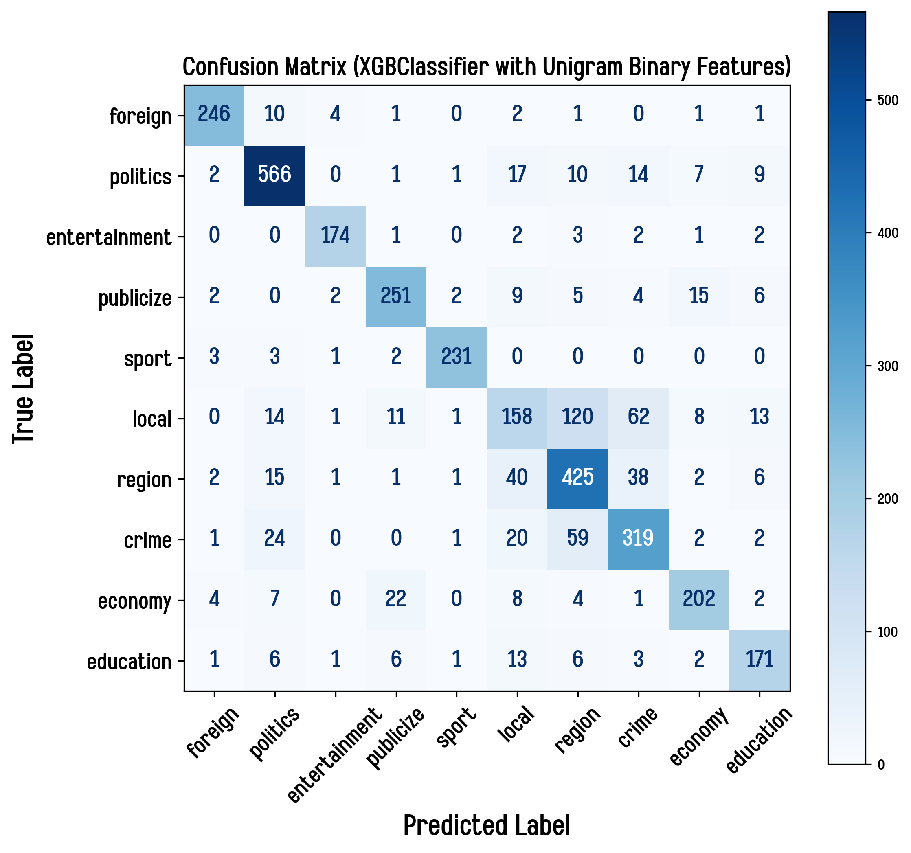
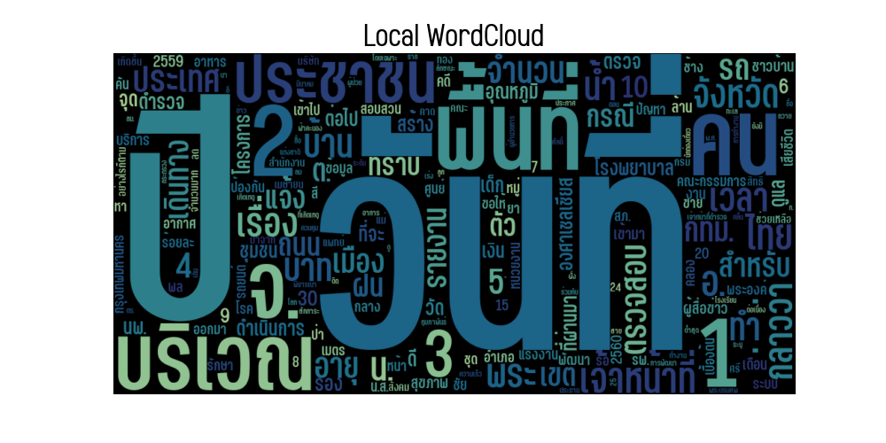
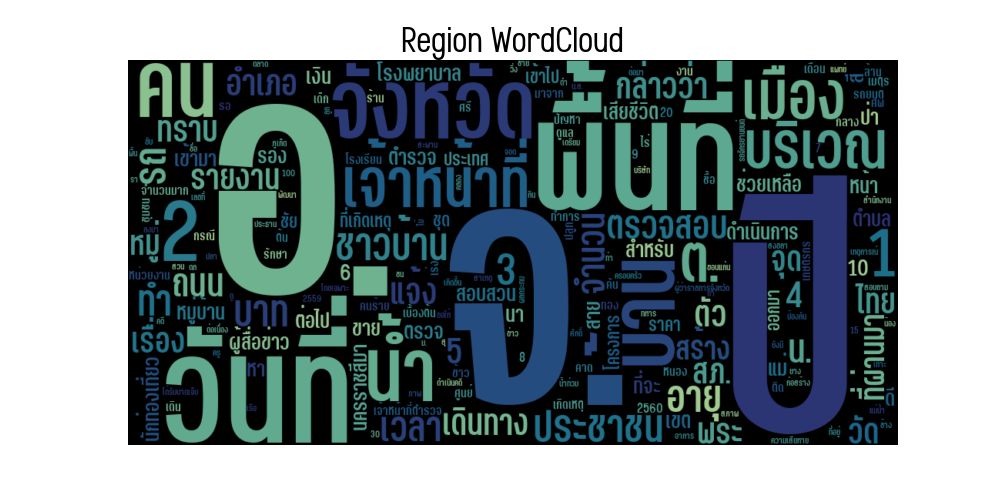
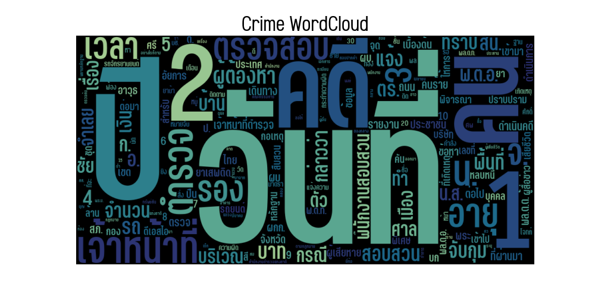

# Text Classification for Matichon News

A freetime project using Logistic Regression and XGBoost to classify news from Matichon into 10 topics: politics, region, crime, local, publicize, foreign, economy, sport, education, entertainment.

# Workflow

1. EDA and text preprocessing 
   * `code/preprocessing.ipynb`
2. Modeling and evaluation
   * `code/logistic-regression.ipynb`
   * `code/xgboost.ipynb` 

# Data Overview

The data used in this project is the Matichon news retrieved from [Matichon Online](https://www.matichon.co.th/) from 2015 to 2018. There are 17,104 records in total after cleaning all duplicated rows.

## Data Dictionary

| Column name | Data type | Description                                                                                                                |
| ----------- | --------- | -------------------------------------------------------------------------------------------------------------------------- |
| `id`        | integer   | Identification number for each news (retrived from the news `url` column, e.g. foreign news id 293 -> `/foreign/news_293`) |
| `url`       | string    | URL of the news                                                                                                            |
| `date`      | datetime  | The date and time which the news is published                                                                              |
| `category`  | string    | The category to which the news belongs                                                                                     |
| `headline`  | string    | Headline of the news                                                                                                       |
| `article`   | string    | The content text of the news                                                                                               |

## News Category

According to Matichon, there are 10 categories for the Matichon news:

1. Politics (ข่าวการเมือง)
2. Region (ข่าวภูมิภาค)
3. Crime (ข่าวอาชญากรรม-กระบวนการยุติธรรม)
4. Local (ข่าวในประเทศ)
5. Publicize (ข่าวประชาสัมพันธ์)
6. Foreign (ข่าวต่างประเทศ)
7. Economy (ข่าวเศรษฐกิจ)
8. Sport (ข่าวกีฬา)
9. Education (ข่าวการศึกษา)
10. Entertainment (ข่าวบันเทิง)

The distribution of each category is described as follows:

# Text Preprocessing

1. Combine `headline` and `article` into `text` data.
2. Tokenize `text` using `pythainlp.tokenize.word_tokenize` with `newmm` engine, because I need it to be fast.
3. Clean `tokenized text` by keeping only Thai and English valid tokens (using Regular Expression) and excluding thai stopwords (retrived from `pythainlp.corpus.thai_stopwords`). I do not keep punctuations because I also used the tokenized text to generate WordCloud for each news category.

# Modeling

In this project, I implemented two machine learning algorithms, Logistic Regression and XGBoost (Extreme Gradient Boosting), to create multi-class classification models. I used `DictVectorizer` and custom functions to vectorize the tokens, and I tried these combinations of features and algorithms as follows:

## Machine Learning Algorithms

1. Logistic Regression with Ridge Regularization
2. XGBoost (Extreme Gradient Boosting)

## Features

1. unigram bag-of-words feature (binary value: not exist = 0 and exist = 1)
2. unigram bag-of-words feature (word count)
3. unigram & bigram bag-of-words feature (binary value)
4. unigram & bigram bag-of-words feature (word count)

For each algorithm, I tried fitting 4 models with each of the features above. Consequently, there are 8 combinations of features and algorithms.

# Model Evaluation

Since there is no class more important than one another, I decided to use `Macro F1 score` as an overview evaluation score, and I decided not to use traditional `Accuracy` because there are some classes that are minority classes, e.g. `Economy` and `Education` news, so `Accuracy` might not represent an actual performance of the model.

| Model                                        | Feature            | Note                             | Macro F1 score   |
| -------------------------------------------- | ------------------ | -------------------------------- | ---------------- |
| Logistic Regression (Ridge Regularization)   | unigram            | binary count (0,1) featurization | 0.81             |
| Logistic Regression (Ridge Regularization)   | unigram + bigram   | binary count (0,1) featurization | **0.82**         |
| Logistic Regression (Ridge Regularization)   | unigram            | token count featurization        | 0.79             |
| Logistic Regression (Ridge Regularization)   | unigram + bigram   | token count featurization        | 0.80             |
| XGBoost                                      | unigram            | binary count (0,1) featurization | **0.82**         |
| XGBoost                                      | unigram + bigram   | binary count (0,1) featurization | **0.82**         |
| XGBoost                                      | unigram            | token count featurization        | 0.81             |
| XGBoost                                      | unigram + bigram   | token count featurization        | 0.81             |

Table of Macro F1 score for each model

From the table above, it seems that binary count featurization outperforms token count featurization regardless of machine learning algorithms. This is probably because some tokens having high frequencies are more influential on the prediction even if they are not actually a keyword. It is also found that XGBoost does slightly better than Logistic Regression. However, Logistic Regression is easier to interpret than XGBoost since Logistic Regression coefficients are separated for each category, while XGBoost's feature importance is an overall importance, not for each category.

# Error Analysis

As we can see from the confusion matrix above, `local`, `region` and `crime` are usually mispredicted, e.g. `local` news predicted as `region`, `region` news predicted as `local`, or `crime` predicted as `local`. So I observed the overall content for each category using WordCloud.

It is found that all the word clouds above look very similar to one another. It is noted that `local` news is about any incidents in Thailand, including Bangkok, `region` news is about any incidents in the countryside of Thailand, and these news can also be related to crime. Accordingly, these news can be mispredicted as `crime` news.
